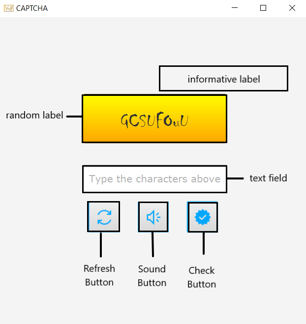

# CAPTCHA PROJECT WITH JAVA
[CAPTCHA](https://support.google.com/a/answer/1217728?hl=en) (Completely Automated Public Turing test to tell Computers and Humans Apart) is a type of security measure known as challenge-response authentication. CAPTCHA helps protect you from spam and password decryption by asking you to complete a simple test that proves you are human and not a computer trying to break into a password protected account.

## Description

When the application is opened, users see two labels, one text field, and three buttons.
* **Labels**
     * **_Informative Label:_**  Gives information when you click the control button
     * **_Random Label:_**  Keeps random expression

* **TextField:** Takes expression from users

* **Buttons**
     * **_Refresh Button:_**  Create a new label (changes random label expression)
     * **_Sound Button:_**  Listen to text speech
     * **_Control Button:_**  Compare your text and label

## How to work?

The users type the expression they see in the random label in the text field.

- Clicks the Check Button
    * If users enter an empty expression and click the check button, the informative label gives information "Please type any character..." to users.
    * If the expression is not empty and the users click the check button;
      - If this expression is true, the informative label gives information "Well Done" to users.
      - If it is false, the informative label gives information "Please try again..." to users and the text field is cleared.

- Clicks the Refresh Button.
    * Random label generates a new expression.

- Clicks the Sound Button
    * Listen to text speech

## License

This project is licensed under the [MIT] License - see the LICENSE.md file for details

## Acknowledgments

Inspiration, code snippets, etc.
* [Convert Text To Speech](https://www.javatpoint.com/convert-text-to-speech-in-java)
* [Icons](https://icons8.com/)
* [FreeTTS](https://sourceforge.net/projects/freetts/files/FreeTTS/FreeTTS%201.2.2/freetts-1.2.2-bin.zip/download?use_mirror=yer)
